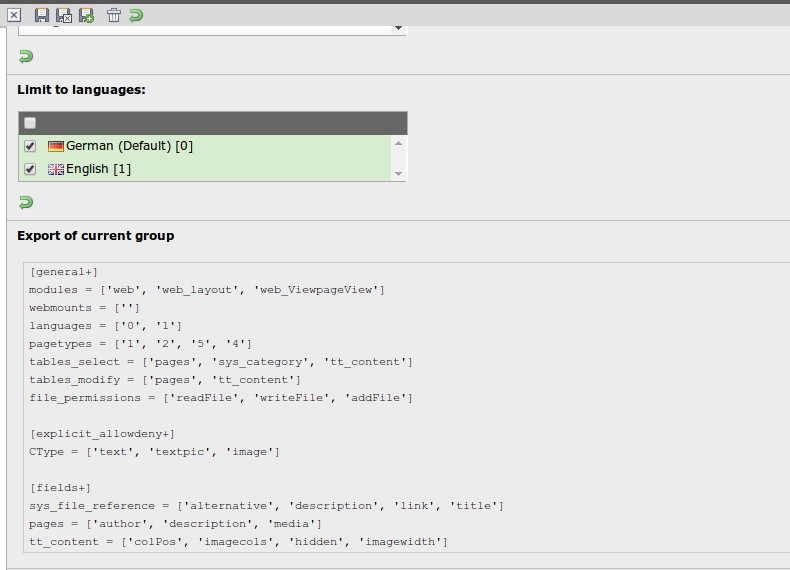

.. ==================================================
.. FOR YOUR INFORMATION
.. --------------------------------------------------
.. -*- coding: utf-8 -*- with BOM.

=============================================================
EXT be_acl_file: Usergroup configuration in files
=============================================================

The configuration of backend users is sometimes quite a hassle.
Furthermore the configuration is stored in the database which means that it is not easily portable to.

This extensions tries to solve those problems by externalizing parts of the configuration to files which can be versionized and deployed.

Screenshots
^^^^^^^^^^^^^^^^


:alt: Export of a current group


Requirements
^^^^^^^^^^^^^^^^
- TYPO3 CMS 6.2


How to use
==================

Using this extension is simple!

After installing the extension you need to configure the path to the configuration files.
This is done in the Extension Manager. The path is relative to the web root.

Permission group assignment
-------------------------------

.. note::

   Sample configuration files are saved in ``typo3conf/ext/be_acl_file/Resources/Private/Example/`` .


A file called ``users.ini`` which is located inside the given path contains the assignment
of access controls which are splitted up into separate files. ::

	[john.doe]
	groups = ['default.ini']

	[max.mustermann]
	groups = ['default.ini', 'news.ini']

This examples means that there are 2 users configured:

- User ``john.doe`` will get all permissions which are saved in the file ``default.ini``.
- User ``max.mustermann`` will get the permissions of the files ``default.ini`` and ``news.ini`` which are merged.


Permissions
-----------------

The permissions itself can be split up into separated files to make bigger user groups better maintainable.
Those files are saved within the directory ``groups/`` which is located within the given path.

This files might look like ::

	[general+]
	modules = ['web', 'web_layout', 'web_list']
	webmounts = ['1']
	languages = ['0']
	pagetypes = ['1', '4', '254']
	tables_select = ['pages', 'sys_file', 'sys_file_metadata', 'sys_file_reference', 'pages_language_overlay', 'tt_content']
	tables_modify = ['pages', 'sys_file', 'sys_file_metadata', 'sys_file_reference']
	file_permissions = ['readFolder', 'readFile', 'writeFile', 'addFile', 'renameFile', 'moveFile', 'deleteFile']

	[explicit_allowdeny+]
	CType = ['text', 'textpic', 'image']
	list_type = ['indexed_search', 'formhandler_pi1']

	[fields+]
	pages_language_overlay = ['hidden', 'keywords', 'doktype']
	sys_file_metadata = ['title']
	sys_file_reference = ['alternative', 'description', 'link', 'showinpreview', 'title']
	tt_content = ['imagecols', 'colPos', 'imageorient', 'imagewidth']

The configuration is split up into groups.

- **general** is about general settings: Allowed modules, Mount pages, languages, allowed page types, ...
- **explicit_allowdeny** includes the allowed content element and plugin types
- **fields** includes all the fields you know from the setting ``Allowed excludefields```.

.. tip::

   You don't need to know all those settings by heart! Just open an existing backend usergroup record,
   configure it like you need it and you will get the correct configuration presented at the bottom of the 2nd tab.


About the parser
-----------------
The following project is used as INI parser: https://github.com/Pixel418/Iniliq.git. Thanks for your work btw!

The documentation includes also all kind of examples how you can use the ini files. Just as an example:

**Reducing options**
It is possible to define permissions in one ini file and revoke parts of those in another file.


Author
==================

Author of this extension is Georg Ringer, Active Contributor of TYPO3 CMS. http://www.montagmorgen.at


Contribution & Bug reports
^^^^^^^^^^^^^^^^^^^^^^^^^^^^

Any contribution is highly welcomed.
Please use the bugtracker of the `GitHub Project <https://github.com/georgringer/be_acl_file/issues>`_
